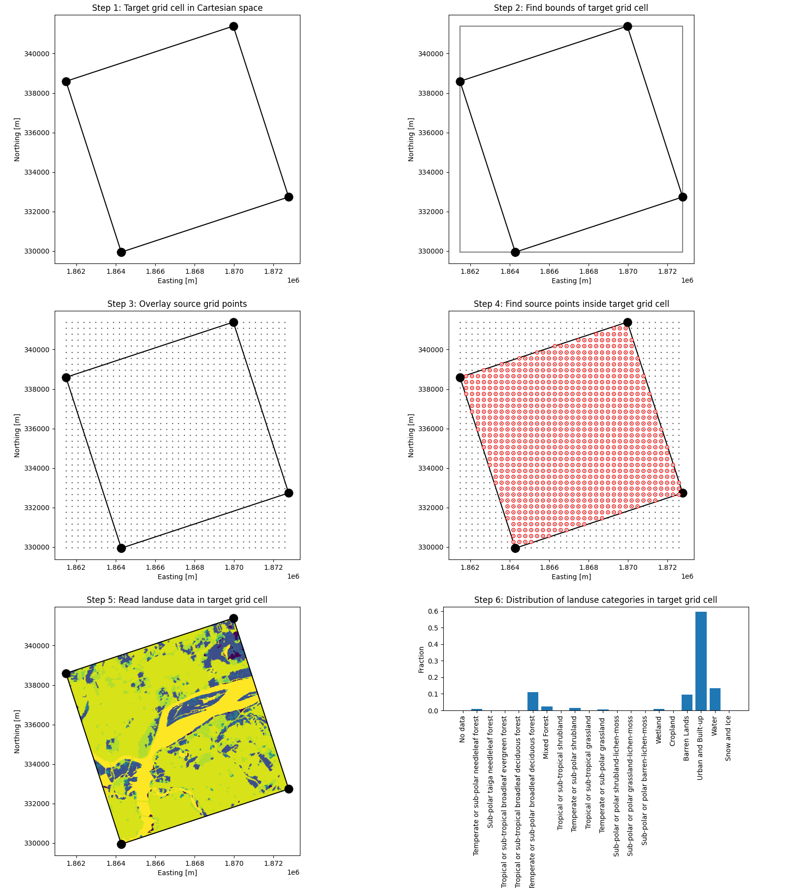

# wrf-nalcms

Process NALCMS land use data for ingestion into WRF.

## Getting started

### Set up Python environment, get dependencies, and install

```
python3 -m venv venv # create a fresh environment
source venv/bin/activate # activate the environment
pip install -U pip # update the package manager
pip install -U https://github.com/cloudruninc/wrf-nalcms # install this package
```

This will install the `nalcms` executable program to your path.

### Download the NALCMS data

1. Follow this [link](http://www.cec.org/north-american-environmental-atlas/land-cover-30m-2015-landsat-and-rapideye/).
2. Download the 30-m land cover from 2015.
3. Unzip `north_america_2015.zip`.
4. Unzip `NA_NALCMS_2015_LC_30m_LAEA_mmu5pix_.zip`.

This will give you a large TIFF file in your path (`NA_NALCMS_2010_v2_LC_30m_LAEA_mmu5pix_.tif`).

### Running nalcms

Type `nalcms -h` or `nalcms --help` to learn how to use nalcms:

```
nalcms --help
usage: nalcms [-h] [-d] [-c {all,urban}] [-u {single,multi}]
              [--low-density-residential LOW_DENSITY_RESIDENTIAL]
              [--high-density-residential HIGH_DENSITY_RESIDENTIAL]
              [--commercial-industrial COMMERCIAL_INDUSTRIAL]
              nalcms_path geo_em_path

nalcms - Process NALCMS land use data for ingestion into WRF

positional arguments:
  nalcms_path           Path to the NALCMS source TIFF file
  geo_em_path           Path to the geo_em target NetCDF file

optional arguments:
  -h, --help            show this help message and exit
  -d, --demo            NALCMS sampling algorithm demo
  -c {all,urban}, --classes {all,urban}
                        Which classes to process
  -u {single,multi}, --urban {single,multi}
                        Whether to use single or multiple (3) urban classes
                        (default single)
  --low-density-residential LOW_DENSITY_RESIDENTIAL
                        Low density residential urban fraction threshold
                        (default 0.6)
  --high-density-residential HIGH_DENSITY_RESIDENTIAL
                        High density residential urban fraction threshold
                        (default 0.9)
  --commercial-industrial COMMERCIAL_INDUSTRIAL
                        Commercial/industrial urban fraction threshold
                        (default 0.95)
```

Example use:

```
nalcms NA_NALCMS_2010_v2_LC_30m_LAEA_mmu5pix_.tif geo_em.d01.nc
```

### Running the algorithm demo

```
nalcms --demo NA_NALCMS_2010_v2_LC_30m_LAEA_mmu5pix_.tif geo_em.d01.nc
```

This will output a set of images describing the sampling procedure, for example:



## Need help?

Write to [help@cloudrun.co](mailto:help@cloudrun.co).
